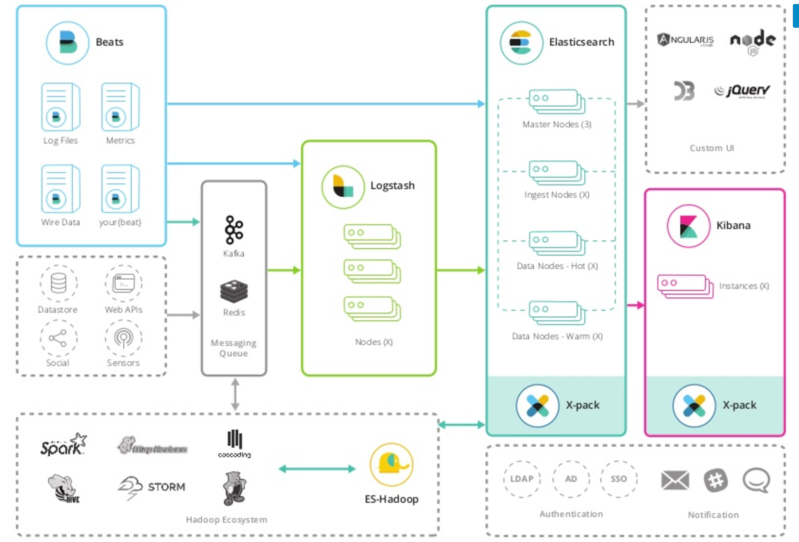

# 基于EBK的应用监控系统

对于一个软件或互联网公司来说，对计算资源和应用进行监控和告警是非常基础的需求。对于大公司或成熟公司，一个高度定制化的监控系统应该已经存在了很长时间
并且非常成熟了。而对于一个初创公司或小公司来说，如何利用现有开源工具快速搭建一套日志监控及分析平台是需要探索的事情。


## 监控系统的用户

运维，开发，产品

## 监控系统的基础功能
收集服务器的各项基础指标，比如memory,cpu,load,network等；
收集应用的状态，jvm状态，是否存活等； 
收集应用日志，并进行分析和统计。通过日志分析和统计可得到应用的访问统计，异常统计，业务统计。具有进行大规模日志数据的分析和处理能力。
可制定告警规则。各种监控数据进入系统后，可以根据条件触发告警，实时的将应用异常情况推送到运维、开发或业务人员的IM/SMS上。
可定制的看板。可以将各种实时统计或报表直观的显示出来。

## 什么是EBK

EBK= elasticsearch + beats (filebeat/metricbeat) + kibana


EBK是ELK的升级版，相对于logstash，beats功能更强大，性能更好，资源消耗小。beats分为filebeat/metricbeat/heartbeat/packetbeat/winlogbeat，其中最常用的是filebeat/metricbeat.

logstach与beat的源流关系请参考：https://logz.io/blog/filebeat-vs-logstash/

## EBK架构


beats 负责收集数据，包括性能数据／业务日志数据

elasticsearch 负责数据存储与搜索

kibana 负责数据展现

logstash 是一个可选的模块，可以对beats收集到的日志进行一定的处理如格式转换，然后将处理结果写入elasticsearch以供查询


### 部署EK集群

zanecloud容器云已经默认集成EBK，部署时只需要加一个with-ebk参数

```
MASTER0_IP=ip0 MASTER1_IP=ip1 MASTER2_IP=ip2 PROVIDER=native API_SERVER=tcp://ip2:8080 \
    bash -x setup-master.sh --with-zlb --with-ebk
```

执行上述命令会生成一个zanecloud容器云，自带一个3节点的elasticsearch集群和kibana。


### 部署与配置filebeat

filebeat是一个go appliation，特点是依赖少运行时资源消耗小，支持linux／windows。安装请参考：
https://www.elastic.co/guide/en/beats/filebeat/current/filebeat-installation.html

在linux 环境下，zanecloud容器云提供一键安装beats的功能；在windows下，请自行安装。

filebeat能够收集指定目录下的日志文件
```
filebeat.prospectors:
- input_type: log
  paths:
    - /var/log/apache/httpd-*.log
  document_type: apache

- input_type: log
  paths:
    - /var/log/messages
    - /var/log/*.log
```

filebeat能够为日志指定tag，便于kibana搜索
```
filebeat.prospectors:
- paths: ["/var/log/app/*.json"]
  tags: ["json"]
```

filebeat可以为日志增加内容
```
filebeat.prospectors:
- paths: ["/var/log/app/*.log"]
  fields:
    app_id: query_engine_12
    hostname: master0
    hostip: 10.10.10.120
```

filebeat可以直接写入到elasticsearch中
```
output.elasticsearch:
  hosts: ["10.45.3.2:9220", "10.45.3.1:9230"]
  protocol: https
  path: /elasticsearch
```

filebeat有很多扩展模块，可以有效收集常见软件的日志，并通过es/kibana展现.

```
filebeat.modules:
- module: nginx
  access:
    var.paths: ["/var/log/nginx/access.log*"]
- module: mysql
- module: system
- module: kafka

```


filebeat 扩展模块列表:https://www.elastic.co/guide/en/beats/filebeat/master/filebeat-modules.html


注意：建议将应用日志以json格式存储，便于扩展与分析。


### 部署与配置metricbeat

metricbeat是性能数据采集模块，支持linux/windows，安装请参考：https://www.elastic.co/guide/en/beats/metricbeat/5.5/metricbeat-installation.html

zanecloud容器云支持linux下一键安装metricbeat

metricbeat默认采集系统基础数据
```
metricbeat.modules:
- module: system
  metricsets:
    - cpu
    - filesystem
    - memory
    - network
    - process
  enabled: true
  period: 10s
  processes: ['.*']
  cpu_ticks: false
```

metricbeat支持apache/nginx/redis/mongodb等常用软件的默认性能数据采集，并通过es/kibana展现
```
metricbeat.modules:
- module: apache
  metricsets: ["status"]
  enabled: true
  period: 1s
  hosts: ["http://127.0.0.1"]
```

metricbeat支持的常见模块包括：https://www.elastic.co/guide/en/beats/metricbeat/5.5/metricbeat-modules.html


性能数据可以直接写入es
```
output.elasticsearch:
  hosts: ["192.168.1.42:9200"]
```

metricbeat有默认的dashboard，可以直接在kibana中使用,安装默认dashboard使用如下命令
```
./scripts/import_dashboards -es http://192.168.33.60:9200
```

### 部署与配置heartbeat

heartbeat是一个监控服务是否存活的工具，同样可以将结果输出到es，在kibana中展现。
```
# Configure monitors
heartbeat.monitors:
- type: http
  urls: ["https://amsterdam.luminis.eu:443"]
  schedule: '@every 60s'
 
- type: http
  urls: ["https://api.devcon.luminis.amsterdam:443/monitoring/ping"]
  schedule: '@every 30s'
 
dashboards.enabled: true
 
output.elasticsearch:
  hosts: ["localhost:9200"]
```

### 与docker集成

filebeat可以直接取每个容器的stdout/stderr，也可以取容器mount到宿主机的日志目录（需要二次开发）
```
   paths:
      - /var/lib/docker/containers/*/*-json.log
    json.keys_under_root: true
    json.add_error_key: true
    json.message_key: log
```

metricbeat 有docker module，可以直接取容器的性能数据
```
 - module: docker
    metricsets: ["container", "cpu", "diskio", "healthcheck","image",  "info", "memory", "network"]
    hosts: ["unix:///var/run/docker.sock"]
    enabled: true
    period: 10s
```
### 日志深度分析

上述架构中，只是对日志进行简单的处理，存入es的数据基本是原始数据，为了满足深层次日志分析与挖掘需求，需要引入新的主键。


```
output.kafka:
  # initial brokers for reading cluster metadata
  hosts: ["kafka1:9092", "kafka2:9092", "kafka3:9092"]

  # message topic selection + partitioning
  topic: '%{[type]}'
  partition.round_robin:
    reachable_only: false

  required_acks: 1
  compression: gzip
  max_message_bytes: 1000000

output.elasticsearch:
  hosts: ["es1:9200","es2:9200","es3:9200"]
```

这样，可以使用spark/jstorm等流处理框架从kafka中读取日志数据，开发复杂逻辑的自定义job处理，处理结果可以存回es，也可以另外保存展现。




### 自定义beat

https://www.elastic.co/guide/en/beats/libbeat/master/community-beats.html

